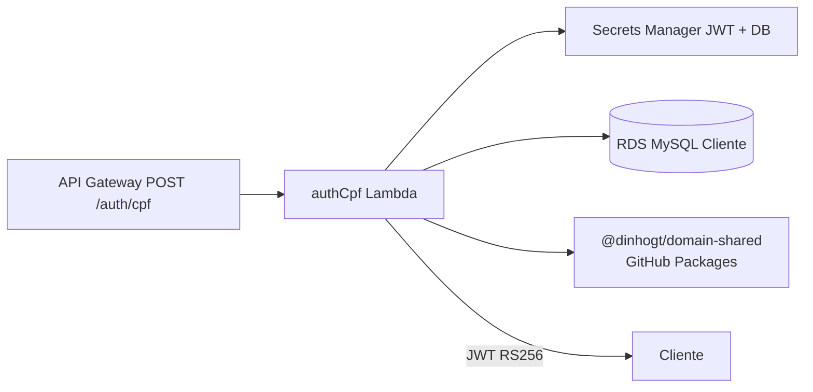

# autoservicemanager-auth-lambda

Lambda **authCpf** (Node 22): autentica cliente por CPF no RDS MySQL e emite **JWT RS256** (ADR-007).

Repositório standalone (pós-cisão). Validações CPF vêm de **`@dinhogt/domain-shared`** publicado no **GitHub Packages** pelo repo [autoservicemanager-app](https://github.com/dinhogt/autoservicemanager-app).

**Docs de arquitetura (canônicos no app):** [RFC-003](https://github.com/dinhogt/autoservicemanager-app/blob/develop/docs/architecture/rfc-003-auth-lambda-rs256.md) · [ADR-007](https://github.com/dinhogt/autoservicemanager-app/blob/develop/docs/architecture/adr-007-jwt-rs256-api-gateway-authorizer.md) · [diagramas](https://github.com/dinhogt/autoservicemanager-app/blob/develop/docs/architecture/diagrams-fase3.md) · [release notes](https://github.com/dinhogt/autoservicemanager-app/blob/develop/docs/release-notes.md)

## Escopo neste repo



| Inclui | Não inclui |
|--------|------------|
| Handler, testes, esbuild zip, CI/CD Lambda | NestJS app, Terraform, manifests K8s |
| Consumo de `domain-shared` via Packages | Publicação do pacote (feita no app) |

## Contrato

`POST /auth/cpf`

```json
{ "cpf": "529.982.247-25" }
```

**200**

```json
{
  "token": "<jwt>",
  "tokenType": "Bearer",
  "expiresIn": 3600,
  "expiresAt": "2026-08-08T12:00:00.000Z"
}
```

Claims: `sub` = CPF dígitos, `scope` = `cliente`, header `kid`, `iss`/`aud` configuráveis.

| Status | Quando |
|--------|--------|
| 400 | CPF ausente/inválido |
| 401 | Cliente inexistente ou inativo |
| 405 | Método ≠ POST |
| 500 | Falha Secrets/DB/assinatura |

## Variáveis

| Var | Obrigatório | Descrição |
|-----|-------------|-----------|
| `DB_SECRET_ARN` | * | JSON Secrets Manager (`host`,`port`,`username`,`password`,`dbname`) |
| `DATABASE_URL` | * | Alternativa local `mysql://...` (vence sobre ARN) |
| `JWT_PRIVATE_KEY_ARN` | * | PEM ou JSON `{ privateKey, kid }` |
| `JWT_PRIVATE_KEY_PEM` | * | Alternativa local (vence sobre ARN) |
| `JWT_KID` | não | default `auth-cpf-1` |
| `JWT_ISS` | não | default `autoservicemanager` |
| `JWT_AUD` | não | default `autoservicemanager-api` |
| `JWT_EXPIRES_IN` | não | segundos, default `3600` |
| `CORS_ORIGIN` | não | default `*` |

\* Um de cada par (ARN ou local) é obrigatório.

## Desenvolvimento

```bash
# Token GitHub com packages:read (ou GITHUB_TOKEN em Actions)
export NODE_AUTH_TOKEN=ghp_...
yarn install
yarn test
yarn build   # → dist/handler.js (esbuild bundle)
yarn package # → auth-cpf.zip
```

`.npmrc` aponta `@dinhogt` para `https://npm.pkg.github.com`.

## domain-shared: publish (app) → consume (lambda)

1. **App** ([autoservicemanager-app](https://github.com/dinhogt/autoservicemanager-app)): bump `packages/domain-shared/package.json`, publish via tag `domain-shared-v*` ou `workflow_dispatch` em [`publish-domain-shared.yml`](https://github.com/dinhogt/autoservicemanager-app/blob/develop/.github/workflows/publish-domain-shared.yml).
2. Pacote `@dinhogt/domain-shared` fica no GitHub Packages (escopo = owner; plano citava `@autoservicemanager/domain-shared`).
3. **Acesso Actions (obrigatório uma vez):** no package → **Package settings** → **Manage Actions access** → adicionar `autoservicemanager-auth-lambda` (read). Sem isso o `GITHUB_TOKEN` deste repo não baixa o pacote.
4. **Este repo:** `"@dinhogt/domain-shared": "0.1.0"` + `.npmrc`. CI: `packages:read` + `NODE_AUTH_TOKEN` (`GITHUB_TOKEN` ou secret opcional `PACKAGES_READ_TOKEN` com `read:packages`).
5. Gerar lock local (token com `read:packages`): `export NODE_AUTH_TOKEN=... && yarn install` e commitar `yarn.lock`.

Swagger / Postman da API Nest: no [app](https://github.com/dinhogt/autoservicemanager-app#documentação-da-api-swagger) · [Postman](https://github.com/dinhogt/autoservicemanager-app/blob/develop/docs/postman/autoservicemanager.postman_collection.json).

## CI/CD

Workflows: [`.github/workflows/ci-cd.yml`](.github/workflows/ci-cd.yml) + [`security-gate.yml`](.github/workflows/security-gate.yml).

| Evento | Ação |
|--------|------|
| PR | `security-gate` → install (Packages) → typecheck → test → bundle |
| Push `develop` | CD homolog: OIDC → `UpdateFunctionCode` |
| Push `master` | CD production: OIDC → `UpdateFunctionCode` |

Secrets: `AWS_ROLE_ARN`, `AUTH_LAMBDA_NAME`. Sem monorepo `paths:` filters.

## Integração

API Gateway HTTP API (stack [infra-k8s](https://github.com/dinhogt/autoservicemanager-infra-k8s)) rota `POST /auth/cpf` → esta Lambda. JWT Authorizer usa JWKS público gerado no mesmo stack.
