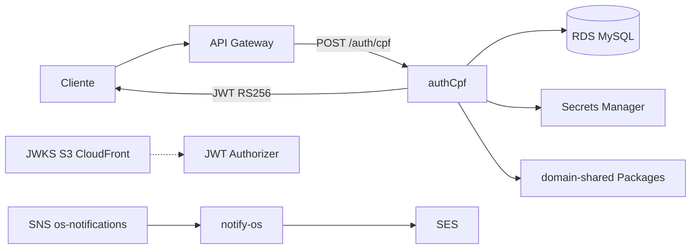

# autoservicemanager-auth-lambda

## Propósito

Function serverless **authCpf**: valida CPF do cliente, consulta existência/status no RDS MySQL e devolve **JWT RS256** para o API Gateway Authorizer (rubrica Fase 3).

## Tecnologias

Node.js 22  · TypeScript  · esbuild  · mysql2  · jsonwebtoken RS256  · `@dinhogt/domain-shared` (GitHub Packages)  · GitHub Actions OIDC

**Docs canônicos (app):** [delivery-index](https://github.com/dinhogt/autoservicemanager-app/blob/develop/docs/architecture/delivery-index.md) · [RFC-003](https://github.com/dinhogt/autoservicemanager-app/blob/develop/docs/architecture/rfc-003-auth-lambda-rs256.md) · [ADR-007](https://github.com/dinhogt/autoservicemanager-app/blob/develop/docs/architecture/adr-007-jwt-rs256-api-gateway-authorizer.md) · [diagramas](https://github.com/dinhogt/autoservicemanager-app/blob/develop/docs/architecture/diagrams-fase3.md)

## Escopo neste repo (diagrama)



| Inclui | Não inclui |
|--------|------------|
| Handlers auth + notify-os, testes, esbuild zips, CI/CD | NestJS app, Terraform, manifests K8s |
| Consumo de `domain-shared` via Packages | Publicação do pacote (feita no app) |

**Dockerfile:** N/A — deploy via zip `UpdateFunctionCode` (não container image).

## Contrato

`POST /auth/cpf`

```json
{ "cpf": "529.982.247-25" }
```

**200**

```json
{
  "token": "<jwt>",
  "tokenType": "Bearer",
  "expiresIn": 3600,
  "expiresAt": "2026-08-08T12:00:00.000Z"
}
```

Claims: `sub` = CPF dígitos, `scope` = `cliente`, header `kid`, `iss`/`aud` configuráveis.

| Status | Quando |
|--------|--------|
| 400 | CPF ausente/inválido |
| 401 | Cliente inexistente ou inativo |
| 405 | Método ≠ POST |
| 500 | Falha Secrets/DB/assinatura |

## Variáveis

| Var | Obrigatório | Descrição |
|-----|-------------|-----------|
| `DB_SECRET_ARN` | * | JSON Secrets Manager (`host`,`port`,`username`,`password`,`dbname`) |
| `DATABASE_URL` | * | Alternativa local `mysql://...` (vence sobre ARN) |
| `JWT_PRIVATE_KEY_ARN` | * | PEM ou JSON `{ privateKey, kid }` |
| `JWT_PRIVATE_KEY_PEM` | * | Alternativa local (vence sobre ARN) |
| `JWT_KID` | não | default `auth-cpf-1` |
| `JWT_ISS` | não | default `autoservicemanager` |
| `JWT_AUD` | não | default `autoservicemanager-api` |
| `JWT_EXPIRES_IN` | não | segundos, default `3600` |
| `CORS_ORIGIN` | não | default `*` |

\* Um de cada par (ARN ou local) é obrigatório.

## Desenvolvimento

```bash
# Token GitHub com packages:read (ou GITHUB_TOKEN em Actions)
export NODE_AUTH_TOKEN=ghp_...
yarn install
yarn test
yarn build   # → dist/handler.js (esbuild bundle)
yarn package # → auth-cpf.zip + notify-os.zip
```

`.npmrc` aponta `@dinhogt` para `https://npm.pkg.github.com`.

## CI/CD

Workflows: [`.github/workflows/ci-cd.yml`](.github/workflows/ci-cd.yml) + [`security-gate.yml`](.github/workflows/security-gate.yml).

| Evento | Ação |
|--------|------|
| PR | `security-gate` ∥ CI: install → typecheck → test → `yarn package` |
| Push `develop` | CD homolog: download artefatos → OIDC → `UpdateFunctionCode` (auth + notify) |
| Push `master` | CD production: idem |

**Proteção:** `master` só via Pull Request; `develop` → homolog; `master` → production. Secrets: `AWS_ROLE_ARN`, `AUTH_LAMBDA_NAME`, `NOTIFY_LAMBDA_NAME` (opcional até o stack k8s criar a function).

## Integração

API Gateway HTTP API (stack [infra-k8s](https://github.com/dinhogt/autoservicemanager-infra-k8s)) rota `POST /auth/cpf` → Lambda auth. SNS `os-notifications` → Lambda notify-os → SES. JWT Authorizer usa JWKS público do mesmo stack.
